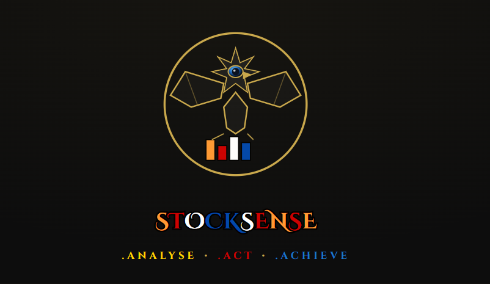
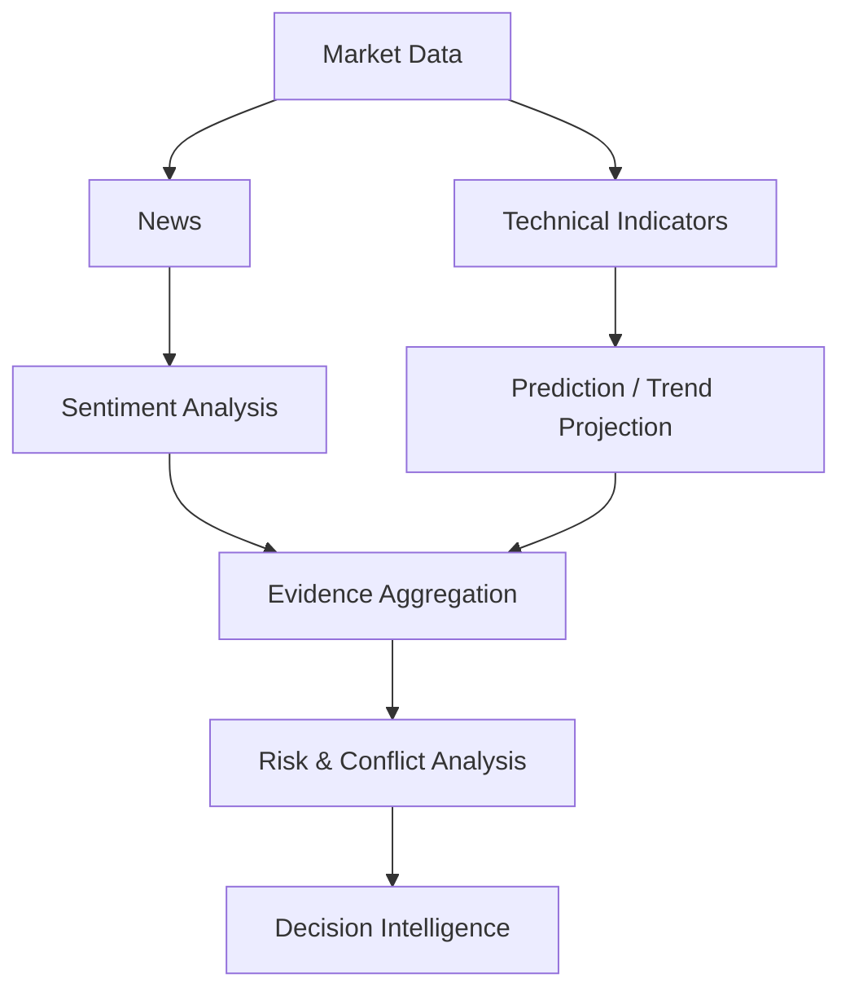

# STOCKSEE

> "Don't predict the market. Understand it."

 <!-- Replace with actual banner if available -->

## 🚀 Live Production

**[Open STOCKSEE →](https://stocksee-market-analytics-and-decis.vercel.app/)**

> Don't predict the market. Understand it.

## Why STOCKSEE Exists

Financial platforms overwhelm users with prices, charts, indicators, news, and signals, but often fail to answer the most critical questions:

- **What actually changed?**
- **Why did it change?**
- **How strong is the evidence?**
- **What conflicts with the thesis?**
- **How reliable is the underlying data?**

STOCKSEE is designed around answering those questions. It is not trying to tell users what stock to buy. It is an intelligence system designed to help users understand the market through evidence, not hype.

## Product Philosophy

- **Evidence over hype**: Analysis is derived from data, not sentiment algorithms alone.
- **Explanation over prediction**: We surface *why* something is happening.
- **Uncertainty over false confidence**: If data conflicts or is unreliable, STOCKSEE flags it.
- **Data quality transparency**: You always know if you're looking at live, delayed, or fallback demo data.
- **Decision intelligence**: Insights are grouped into actionable clusters.
- **Institutional rigor**: Dense, readable, and highly analytical.

## Core Intelligence Loop



## Key Capabilities

- **Market Context**: Instantly grasp the broader market state.
- **Real-time Quotes & Historical Data**: Granular OHLCV data backed by an orchestrated provider hierarchy.
- **Technical Indicators**: On-the-fly calculation of RSI, MACD, and moving averages.
- **Signal Generation**: Deterministic heuristic intelligence engine combining technicals and sentiment.
- **News Intelligence**: Aggregated market news tied directly to sentiment analysis.
- **Evidence Panels & Risk Assessment**: See exactly what supports a bullish or bearish thesis and where conflicts exist.
- **Data Quality Badges**: Transparent UI indicators for data source and confidence levels.
- **Watchlist Intelligence**: Monitor your portfolio with instant signal updates.
- **Command Search (⌘K)**: Global, keyboard-driven institutional command palette for instant navigation.

## Intelligence Workspace

STOCKSEE utilizes a Stitch-inspired institutional design language:
- **Ink & Slate Visuals**: A deep, near-black background with zinc/slate surfaces.
- **Institutional Density**: A 12-column analytical layout designed to maximize information density without clutter.
- **Restrained Color Palette**: Emerald (bullish), Rose (bearish), Amber (uncertainty), and Sky (interaction).
- **Typography**: Monospaced financial data (JetBrains Mono) and clean UI text (Inter) for absolute precision.

## Market Data Architecture

STOCKSEE uses a resilient, fallback-driven data architecture to ensure availability while maintaining absolute transparency.

**Quote Providers:**
`Finnhub` → `YFinance` → `Demo fallback`

**History Providers:**
`Alpha Vantage` → `Finnhub` → `YFinance` → `Demo fallback`

*Why separate chains?* 
To ensure that a rate-limit on a historical provider (e.g., Alpha Vantage's free tier) does not accidentally degrade real-time quote capabilities if Finnhub is still operational. Data quality badges in the UI explicitly surface when data degrades to a fallback or demo state.

## Production Architecture

- **Frontend**: React, TypeScript, Vite, Tailwind CSS, Lucide Icons, Recharts.
- **Backend**: FastAPI, Python, SQLAlchemy, Alembic.
- **Database**: PostgreSQL (Supabase) via Transaction Pooler.
- **Authentication**: Clerk.
- **Caching**: PostgreSQL-backed intelligent payload caching.
- **Sentiment Engine**: VADER heuristic sentiment analysis.
- **Deployment**: Vercel (Frontend), Render (Backend).

## Reliability Model

`Real data` → `Provider fallback` → `Demo fallback` → `Transparent data quality`

STOCKSEE will **never** silently present demo data as real. If the provider chain fails due to datacenter rate-limits or missing API keys, the UI clearly reflects a "LOW" data quality or "Demo" state.

## Security

- **Environment-based Secrets**: No keys are committed to the repository.
- **Clerk Authentication**: Secure, managed identity.
- **Protected Endpoints**: API routes are secured and isolated.
- **CORS Controls**: Strict origin enforcement.

## Current Production Status

- **Frontend Deployment**: Operational (Vercel)
- **Backend Deployment**: Operational (Render)
- **PostgreSQL**: Connected (Supabase Transaction Pooler)
- **Finnhub Real-time Quote**: Operational
- **Historical Data**: Subject to provider availability / gracefully falls back
- **Signal Engine**: Operational
- **Authentication**: Operational

## Development Setup

### Environment Variables
Configure the following variables in your `.env` files (Do not commit real values):

**Backend (`backend/.env`)**
```
DATABASE_URL=
ENVIRONMENT=
LOG_LEVEL=
CORS_ORIGINS=
FINNHUB_API_KEY=
ALPHA_VANTAGE_API_KEY=
SUPABASE_URL=
SUPABASE_ANON_KEY=
SUPABASE_SERVICE_ROLE_KEY=
CLERK_PUBLISHABLE_KEY=
CLERK_SECRET_KEY=
```

**Frontend (`frontend/.env`)**
```
VITE_API_BASE_URL=
VITE_CLERK_PUBLISHABLE_KEY=
```

## Contributing

See [CONTRIBUTING.md](CONTRIBUTING.md) for development guidelines, philosophy, and pull request processes.

## Security

See [SECURITY.md](SECURITY.md) for reporting vulnerabilities.

## License

Copyright (c) 2026 Essakki Raja T. Licensed under the [MIT License](LICENSE).

## Contact

essakki.data@gmail.com
