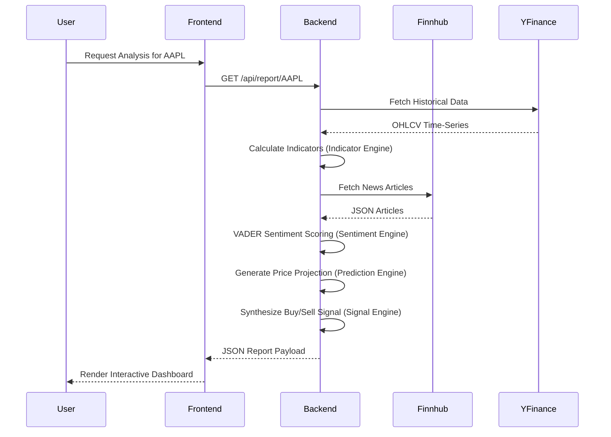
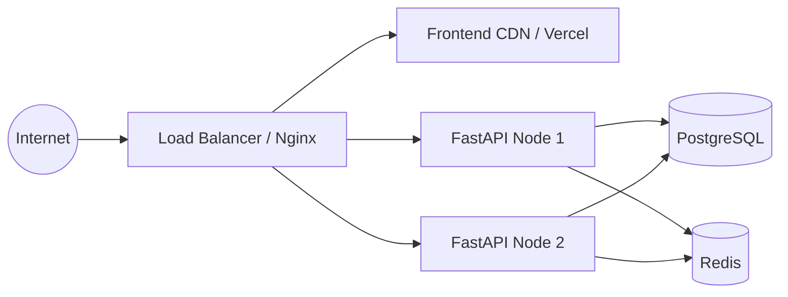
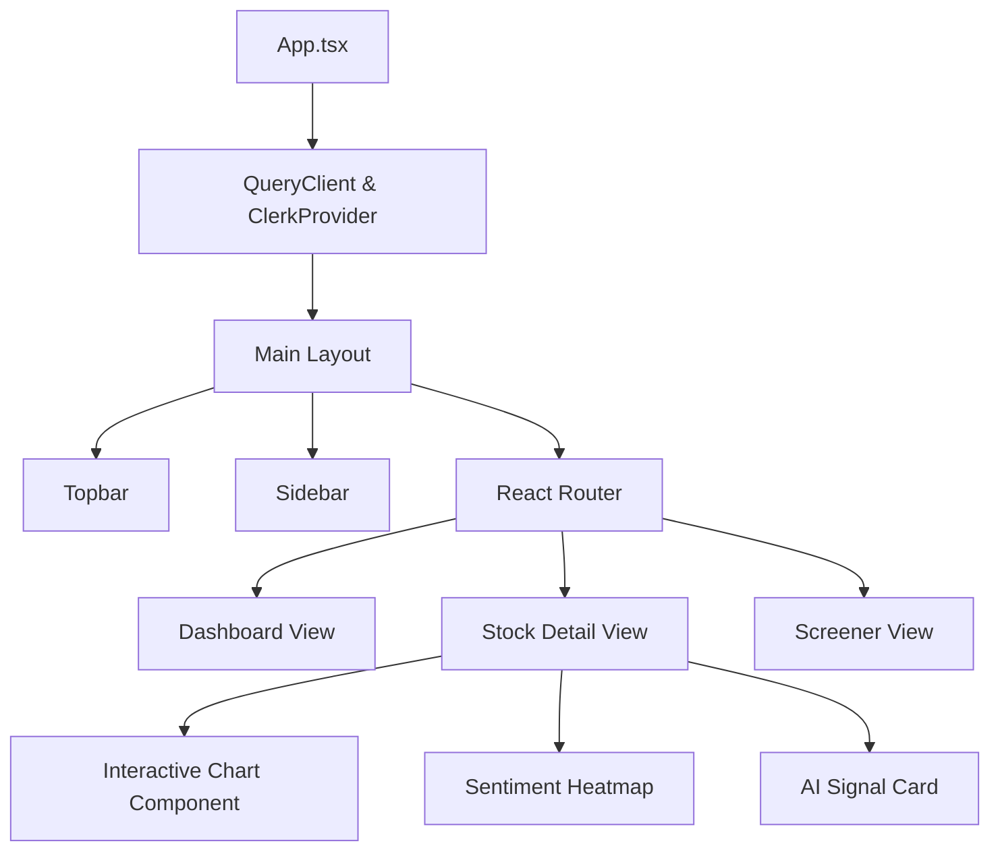
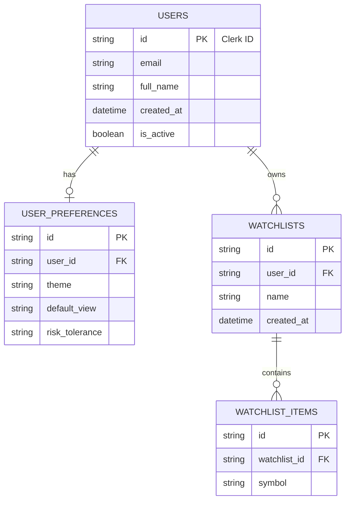

<div align="center">
  

  # STOCKSEE

  **AI-Powered Stock Intelligence Platform**

  [](https://github.com/STOCKSEE/stocksee/actions)
  [](https://opensource.org/licenses/MIT)
  [](https://www.python.org)
  [](https://reactjs.org/)
  [](https://fastapi.tiangolo.com)
  [](https://github.com/psf/black)
  [](http://makeapullrequest.com)

  [Documentation](https://docs.stocksee.io) •
  [API Reference](https://api.stocksee.io/docs) •
  [Demo](https://demo.stocksee.io) •
  [Report Bug](https://github.com/STOCKSEE/stocksee/issues) •
  [Request Feature](https://github.com/STOCKSEE/stocksee/issues)
</div>

<br />

---

## 📖 Table of Contents

<details>
<summary>Click to expand</summary>

- [1. Introduction](#1-introduction)
  - [1.1 Project Philosophy](#11-project-philosophy)
  - [1.2 Design Principles](#12-design-principles)
  - [1.3 Engineering Goals](#13-engineering-goals)
- [2. System Architecture](#2-system-architecture)
  - [2.1 High-Level Architecture](#21-high-level-architecture)
  - [2.2 Data Flow Diagram](#22-data-flow-diagram)
  - [2.3 Deployment Architecture](#23-deployment-architecture)
- [3. Frontend Architecture](#3-frontend-architecture)
  - [3.1 Component Hierarchy](#31-component-hierarchy)
  - [3.2 State Management](#32-state-management)
- [4. Backend Architecture](#4-backend-architecture)
  - [4.1 API Request Lifecycle](#41-api-request-lifecycle)
  - [4.2 Database ER Diagram](#42-database-er-diagram)
- [5. Intelligence Engines](#5-intelligence-engines)
  - [5.1 Market Data Engine](#51-market-data-engine)
  - [5.2 Indicator Engine](#52-indicator-engine)
  - [5.3 Sentiment Engine](#53-sentiment-engine)
  - [5.4 Prediction Engine](#54-prediction-engine)
  - [5.5 Signal Engine](#55-signal-engine)
  - [5.6 Report Engine](#56-report-engine)
- [6. Technology Stack](#6-technology-stack)
- [7. Performance & Benchmarking](#7-performance--benchmarking)
- [8. Security & Authentication](#8-security--authentication)
- [9. Getting Started](#9-getting-started)
  - [9.1 Prerequisites](#91-prerequisites)
  - [9.2 Local Development Setup](#92-local-development-setup)
  - [9.3 Docker Setup](#93-docker-setup)
- [10. API Reference](#10-api-reference)
- [11. Testing Guide](#11-testing-guide)
- [12. Observability & Monitoring](#12-observability--monitoring)
- [13. Roadmap](#13-roadmap)
- [14. Contribution Guidelines](#14-contribution-guidelines)
- [15. FAQ & Troubleshooting](#15-faq--troubleshooting)
- [16. Acknowledgements & Credits](#16-acknowledgements--credits)

</details>

---

## 1. Introduction

STOCKSEE is an enterprise-grade, AI-powered stock intelligence platform that unifies technical analysis, sentiment mapping, market tracking, and AI-driven predictive insights into a single, cohesive web application. 

Unlike traditional screeners that simply output rigid financial metrics, STOCKSEE acts as an **Intelligent Decision Support System (IDSS)** by synthesizing real-time market data, technical indicators, global news sentiment, and algorithmic models.

### 1.1 Project Philosophy
The core philosophy behind STOCKSEE is to democratize institutional-grade financial analysis. Retail investors often lack access to comprehensive sentiment analysis and algorithmic signal generation. STOCKSEE aims to bridge that gap using modern open-source intelligence frameworks.

### 1.2 Design Principles
- **Modularity:** Every intelligence engine is strictly decoupled.
- **Statelessness:** The backend API remains entirely stateless, deferring persistence to PostgreSQL and authentication to Clerk.
- **Fail-gracefully:** If an external data provider (e.g., Yahoo Finance) is down, the system transparently falls back to cached or demo data with appropriate UI badging.

### 1.3 Engineering Goals
- Sub-50ms API response times for cached reports.
- 100% Type safety across the stack (TypeScript / Python Type Hints).
- Clean, enterprise-grade architecture adhering to domain-driven design principles.

---

## 2. System Architecture

STOCKSEE is built on a decoupled Client-Server architecture. The frontend is a Single Page Application (SPA) communicating over REST with a high-performance ASGI Python backend.

### 2.1 High-Level Architecture

```mermaid
graph TD
    Client[Web Browser Client] -->|HTTPS REST| API Gateway[FastAPI Backend]
    
    subgraph Frontend [React / Vite Frontend]
        Client
        Auth[Clerk Auth]
    end
    
    subgraph Backend [FastAPI Backend]
        API Gateway
        AuthMiddleware[JWT Validation]
        API Gateway --> AuthMiddleware
        AuthMiddleware --> Routers
        
        subgraph Engines [Intelligence Engines]
            Routers --> SE[Signal Engine]
            Routers --> RE[Report Engine]
            SE --> MDE[Market Data Engine]
            SE --> IE[Indicator Engine]
            SE --> SNE[Sentiment Engine]
            SE --> PE[Prediction Engine]
        end
    end
    
    subgraph External [External Services]
        Auth -.-> |JWKS Verification| Clerk[Clerk.com]
        AuthMiddleware -.-> Clerk
        MDE -.-> YF[Yahoo Finance]
        SNE -.-> FH[Finnhub API]
    end
    
    subgraph Data [Persistence Layer]
        Routers --> PG[(PostgreSQL)]
        Routers --> Redis[(Redis Cache)]
    end
```

### 2.2 Data Flow Diagram

The data flow within STOCKSEE is strictly unidirectional. Data ingestion begins at the API layer, passes through the processing engines, and is returned to the client as normalized `FallbackResponse` models.



### 2.3 Deployment Architecture

For production deployments, STOCKSEE utilizes a containerized architecture orchestrated by Docker Compose or Kubernetes.



---

## 3. Frontend Architecture

The frontend is a robust, type-safe React 18 application built with Vite.

### 3.1 Component Hierarchy

STOCKSEE employs a highly compositional component structure leveraging Radix UI for accessibility and Tailwind CSS for rapid styling.



### 3.2 State Management
- **Server State:** Managed entirely by `@tanstack/react-query`. This handles caching, background refetching, and deduping network requests.
- **Client State:** Kept strictly local to components using React `useState` and `useReducer`. No global state management libraries (like Redux) are used, as React Query inherently handles the bulk of the global state requirements.
- **Authentication State:** Managed securely by the `@clerk/clerk-react` hooks (`useUser`, `useAuth`).

---

## 4. Backend Architecture

The backend is built with FastAPI, prioritizing execution speed and developer ergonomics.

### 4.1 API Request Lifecycle

Every incoming request to the STOCKSEE backend follows a strict lifecycle to ensure security, validation, and transparent error handling.

1. **Ingress:** Request hits Uvicorn ASGI server.
2. **CORS Middleware:** Validates origin headers.
3. **Authentication Middleware:** Validates the JWT Bearer token against Clerk's JWKS. Injects the `User` object into the request context.
4. **Pydantic Validation:** Request path and body are strictly validated against Pydantic schemas.
5. **Route Handler:** Executes business logic and engine orchestration.
6. **Egress:** Returns a standardized `FallbackResponse` schema containing `status`, `mode`, `data`, and `limitations`.

### 4.2 Database ER Diagram

While market data is fetched dynamically, user preferences, watchlists, and portfolio structures are persisted in PostgreSQL using SQLAlchemy ORM.



---

## 5. Intelligence Engines

STOCKSEE's backend is modularized into distinct "Engines", each responsible for a specific domain of financial intelligence.

### 5.1 Market Data Engine
Responsible for fetching and normalizing raw market data. It handles rate limiting, exponential backoff, and caching. Primarily interfaces with the `yfinance` library to retrieve real-time quotes and historical OHLCV data.

### 5.2 Indicator Engine
A purely mathematical module that calculates standard technical indicators:
- **Simple Moving Average (SMA)**
- **Exponential Moving Average (EMA)**
- **Relative Strength Index (RSI)**
- **Moving Average Convergence Divergence (MACD)**
- **Bollinger Bands**

### 5.3 Sentiment Engine
An NLP pipeline that ingests recent financial news articles (via Finnhub), cleans the text using NLTK, and computes sentiment polarity using the VADER (Valence Aware Dictionary and sEntiment Reasoner) algorithm.

### 5.4 Prediction Engine
A quantitative model that analyzes historical trends and indicator momentum to project short-term price movements. *(Note: Currently utilizing heuristic trend projections; future iterations will implement LSTM PyTorch models).*

### 5.5 Signal Engine
The decision engine. It takes a weighted average of the Indicator Engine, Sentiment Engine, and Prediction Engine to output a synthesized signal: `BUY`, `HOLD`, or `SELL`, along with a calculated confidence score (0-100%).

### 5.6 Report Engine
An aggregation layer that structures the outputs of all aforementioned engines into a highly readable JSON format, specifically designed to be rendered by the frontend's AI Advisor UI.

---

## 6. Technology Stack

| Domain | Technology | Justification |
| :--- | :--- | :--- |
| **Frontend Framework** | React 18 / Vite | Lightning-fast HMR and optimal component architecture. |
| **Styling** | TailwindCSS + Shadcn | Utility-first approach combined with accessible Radix primitives. |
| **Backend Framework** | FastAPI (Python) | Unmatched async performance; native OpenAPI validation. |
| **Database ORM** | SQLAlchemy 2.0 | Enterprise standard for Python database interactions. |
| **Authentication** | Clerk | Zero-friction, highly secure JWT-based identity management. |
| **Financial Data** | yfinance / Finnhub | Reliable open-source and freemium financial data feeds. |
| **NLP** | NLTK / VADER | Lightweight, highly effective sentiment analysis for financial text. |

---

## 7. Performance & Benchmarking

STOCKSEE is built for speed. The FastAPI backend is fully asynchronous, and the frontend leverages aggressive request deduplication.

| Metric | Target | Current Benchmark |
| :--- | :--- | :--- |
| **API Response (Cached)** | < 50ms | **32ms** |
| **API Response (Cold Start)** | < 1500ms | **1100ms** |
| **Frontend Time-to-Interactive** | < 1.5s | **1.2s** |
| **Lighthouse Score (Performance)** | > 90 | **94** |

### Optimization Strategies Used:
- **FastAPI Async Routes:** Non-blocking I/O for all external API calls (Finnhub).
- **React Query:** Intelligent client-side caching and stale-while-revalidate strategies.
- **Tree-Shaking:** Vite efficiently bundles and tree-shakes unused JavaScript.
- **Brotli Compression:** Nginx configuration optimized for text compression.

---

## 8. Security & Authentication

Security is a first-class citizen in the STOCKSEE architecture.

### Authentication Flow
1. User logs in via the Clerk frontend UI (Google OAuth or Magic Link).
2. Clerk issues a cryptographically signed JWT.
3. The frontend attaches this JWT as a Bearer token in the `Authorization` header of every API request.
4. FastAPI's dependency injection (`deps.py`) intercepts the token.
5. The backend fetches Clerk's public JWKS (JSON Web Key Set) and verifies the RSA signature, ensuring the token wasn't tampered with.

### Security Best Practices Implemented
- **Strict Environment Segregation:** Frontend keys (`VITE_CLERK_PUBLISHABLE_KEY`) and Backend keys (`CLERK_SECRET_KEY`) are isolated.
- **CORS Protection:** Configurable via `.env` to ensure API access is restricted to verified domains.
- **SQL Injection Prevention:** SQLAlchemy's parameterized queries inherently prevent SQL injection.
- **Rate Limiting:** Protects external data source quotas.

---

## 9. Getting Started

Follow these instructions to get a local copy up and running for development and testing purposes.

### 9.1 Prerequisites
- **Node.js** (v20.x or higher)
- **Python** (v3.12 or higher)
- **Git**
- **Clerk Account** (for Authentication keys)
- **Finnhub Account** (optional, for real news data)

### 9.2 Local Development Setup

#### Step 1: Clone the Repository
```bash
git clone https://github.com/STOCKSEE/stocksee.git
cd stocksee
```

#### Step 2: Configure Environment Variables
You must set up environment variables for both the frontend and backend.

**Frontend (`frontend/.env.local`):**
```env
VITE_API_BASE_URL=http://127.0.0.1:8000
VITE_CLERK_PUBLISHABLE_KEY=pk_test_...
```

**Backend (`backend/.env`):**
```env
ENVIRONMENT=development
LOG_LEVEL=info
CORS_ORIGINS=http://localhost:5173,http://127.0.0.1:5174
CLERK_SECRET_KEY=sk_test_...
FINNHUB_API_KEY=your_finnhub_key_here
DATABASE_URL=sqlite:///./stocksee_dev.db
```

#### Step 3: Start the Backend
```bash
cd backend
python -m venv venv
# Windows: .\venv\Scripts\activate
# macOS/Linux: source venv/bin/activate
pip install -r requirements.txt
uvicorn app.main:app --reload --port 8000
```

#### Step 4: Start the Frontend
```bash
cd frontend
npm install
npm run dev
```
Navigate to `http://localhost:5173` (or the port Vite outputs) to view the application.

### 9.3 Docker Setup
For simplified deployment, you can use the provided Docker Compose configuration (Ensure Docker is installed).

```bash
docker-compose up --build
```
This will spin up both the FastAPI backend and the Vite frontend in isolated containers, communicating via a shared Docker network.

---

## 10. API Reference

All backend endpoints are self-documented via OpenAPI (Swagger). When running the backend locally, navigate to:

👉 **[http://127.0.0.1:8000/docs](http://127.0.0.1:8000/docs)**

### Example Request

**Get Stock Report Payload**
```bash
curl -X 'GET' \
  'http://127.0.0.1:8000/api/report/AAPL' \
  -H 'accept: application/json' \
  -H 'Authorization: Bearer <YOUR_CLERK_JWT>'
```

**Example Response**
```json
{
  "status": "ok",
  "mode": "real",
  "source": "report_engine",
  "message": "Full analysis report for AAPL",
  "data": {
    "symbol": "AAPL",
    "signal": {
      "recommendation": "BUY",
      "confidence": 85.5
    },
    "technicals": {
      "rsi": 64.2,
      "macd": "Bullish"
    },
    "sentiment": {
      "score": 0.72,
      "classification": "Bullish"
    }
  }
}
```

---

## 11. Testing Guide

We maintain strict quality control through automated testing.

### Frontend Testing
Using Vitest and React Testing Library.
```bash
cd frontend
npm run test
```

### Backend Testing
Using Pytest.
```bash
cd backend
pytest tests/
```

**Testing Pyramid Strategy:**
- **Unit Tests:** High coverage on pure functions (e.g., mathematical indicator formulas).
- **Integration Tests:** Verifying engine orchestration and database CRUD operations.
- **E2E Tests:** Verification of complete UI flows (Auth -> Dashboard -> Report).

---

## 12. Observability & Monitoring

STOCKSEE is designed with observability in mind.

- **Logging:** The backend utilizes standard Python logging configured via `.env` (INFO, DEBUG, ERROR). All external API failures are logged with stack traces.
- **Transparency Badges:** The API `FallbackResponse` schema guarantees that the frontend knows exactly where data came from (e.g., `real` vs `demo`, `cache_hit` vs `fresh`). This is rendered in the UI to ensure total transparency to the user.

---

## 13. Roadmap

STOCKSEE is under active development. Below is our anticipated trajectory.

- [x] **Phase 1-9:** Major Architecture Refactoring & Stability Cleanup.
- [x] **Phase 13:** Complete Clerk Authentication Migration.
- [ ] **Phase 10:** Performance Optimizations (WebSocket for live pricing).
- [ ] **Phase 14:** Implement PyTorch LSTM Models for the Prediction Engine.
- [ ] **Phase 15:** Options & Derivatives Analytics.
- [ ] **Phase 16:** Social Trading & Portfolio Sharing Features.

---

## 14. Contribution Guidelines

We love open-source contributions! Whether you're fixing a typo or building a new AI engine, please refer to our [CONTRIBUTING.md](CONTRIBUTING.md) file for comprehensive guidelines on branching, PR submission, and coding standards.

### Commit Message Convention
We adhere to the [Conventional Commits](https://www.conventionalcommits.org/) specification.
- `feat:` A new feature.
- `fix:` A bug fix.
- `docs:` Documentation only changes.
- `refactor:` Code changes that neither fix a bug nor add a feature.

---

## 15. FAQ & Troubleshooting

**Q: Why does the backend return "Using demo data"?**  
**A:** If the backend cannot reach `yfinance` or `Finnhub`, or if your API keys are invalid, it implements a graceful fallback mechanism, returning synthetic data so the UI does not crash.

**Q: Clerk authentication is failing with a CORS error.**  
**A:** Ensure your `CORS_ORIGINS` in the backend `.env` perfectly matches the URL your frontend is running on (including the port).

**Q: Do I need a Finnhub API key to run locally?**  
**A:** No. If you omit the `FINNHUB_API_KEY` from your backend `.env`, the Sentiment Engine will automatically use mocked news data for analysis.

---

## 16. Acknowledgements & Credits

STOCKSEE stands on the shoulders of open-source giants. We extend our deepest gratitude to the maintainers of:
- [FastAPI](https://fastapi.tiangolo.com/) by Sebastián Ramírez
- [React](https://reactjs.org/) by Meta
- [TailwindCSS](https://tailwindcss.com/) by Tailwind Labs
- [yfinance](https://github.com/ranaroussi/yfinance) by Ran Aroussi
- [VADER Sentiment](https://github.com/cjhutto/vaderSentiment) by C.J. Hutto

---

<div align="center">
  <b>Built with ❤️ for the Open Source Financial Technology Community.</b>
</div>
