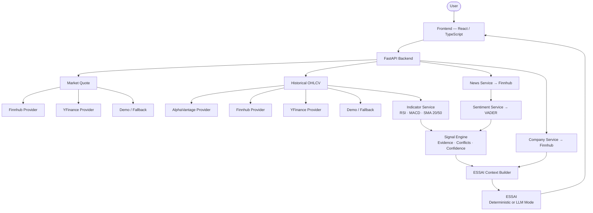
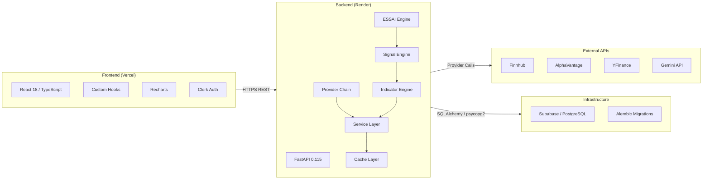

<p align="center">
  
</p>

<p align="center">
  <a href="https://fastapi.tiangolo.com"></a>
  <a href="https://react.dev"></a>
  <a href="https://supabase.com"></a>
  <a href="https://vercel.com"></a>
  <a href="https://render.com"></a>
  <a href="LICENSE"></a>
</p>

---

## Product Overview

STOCKSEE is a stock analysis and decision-support platform designed to help investors **understand** a stock — not predict it.

Most financial platforms compete on data volume, chart widgets, and price alerts. STOCKSEE is built around a different premise: that genuine understanding of a stock requires **evidence, context, confidence measurement, and intellectual honesty about uncertainty**.

STOCKSEE assembles real market data, technical indicators, news sentiment, company intelligence, and conflict detection — then synthesises them through **ESSAI**, its analytical intelligence layer — to produce a structured, evidence-based view of any stock.

**Who it is for:**

- Investors who want to understand what they are buying, not just the price.
- Analysts who want structured evidence alongside technical indicators.
- Developers building or studying modern financial intelligence applications.

**What makes it different:**

- Intelligence layer that interprets evidence, not a price ticker with decoration.
- Explicit confidence scoring with transparent methodology.
- Honest data-quality transparency — every price and indicator is labeled with its source and mode.
- Counter-evidence and conflict detection built into the decision engine.
- No fabricated financial data at any layer of the stack.

---

## ESSAI — STOCKSEE Intelligence

**ESSAI** (pronounced *essay*) is the intelligence layer of STOCKSEE.

It is not a chatbot. It is not a prediction engine. It is an evidence interpreter.

ESSAI receives a structured context assembled from all available analytical data for a stock — and produces a structured intelligence view covering:

| Input | Description |
|---|---|
| Market Quote | Real-time or most-recent available price, change, source |
| Historical OHLCV | Price history from the provider chain |
| Technical Indicators | RSI (14-period), MACD, SMA 20, SMA 50, EMA 20, EMA 50 |
| Signal Engine Output | Deterministic evidence classification and conflict detection |
| Confidence Score | Data-quality-weighted evidence score |
| News Headlines | Labeled external text — treated as untrusted input |
| VADER Sentiment | Compound sentiment score over recent news |
| Company Profile | Name, sector, industry, description, exchange |
| Data Provenance | Mode and source for every data point |

### ESSAI Operating Modes

ESSAI operates in two modes depending on environment configuration:

**Deterministic Mode** (default when no LLM key is configured)

All analysis is performed by the deterministic Python signal engine. ESSAI interprets pre-computed technical and sentiment evidence using explicit rule-based logic. Every output is reproducible: same inputs produce the same structured view. This is the mode currently active on the production backend.

**LLM Mode** (when `GEMINI_API_KEY` or `OPENAI_API_KEY` is set)

The deterministic analytics are preserved. The LLM receives a structured, pre-computed context (not raw market data) and produces a plain-language intelligence synthesis. The LLM interprets evidence — it does not recalculate anything independently. External news text is labeled `UNTRUSTED EXTERNAL TEXT` in the prompt.

### ESSAI Output

```json
{
  "view": "Bullish Setup | Bearish Setup | Neutral / Wait | High Uncertainty | Risk Elevated",
  "confidence_score": 65,
  "confidence_level": "MEDIUM",
  "evidence_quality": "HIGH | MEDIUM | LOW",
  "summary": "Evidence-based plain-English synthesis",
  "supporting_evidence": ["Technical and sentiment signals aligned."],
  "contradicting_evidence": ["RSI indicates overbought extension."],
  "risks": ["Conflict: Trend bullish, but MACD momentum weakening."],
  "watch_items": ["Monitor volume confirmation."],
  "data_provenance": {
    "price_source": "finnhub",
    "price_quality": "HIGH",
    "analytics_quality": "HIGH"
  },
  "disclaimer": "Analysis only. Not financial advice.",
  "_mode": "deterministic | llm"
}
```

ESSAI never:
- Invents price values.
- Fabricates company information.
- Claims certainty of market outcomes.
- Guarantees returns.
- Presents LLM output as deterministic fact.

---

## Core Analytical Workflow



---

## Product Capabilities

### Market Intelligence
- Real-time equity quotes via Finnhub free tier.
- Multi-provider fallback chain (Finnhub → YFinance → Stale Cache → Demo).
- Every price labeled with its source and mode (`real`, `stale_cache`, `demo`).
- Ticker bar with live price updates.

### Stock Analysis
- OHLCV historical data across 9 time periods (1D, 1W, 1M, 3M, 6M, 1Y, 3Y, 5Y, MAX).
- RSI, MACD, SMA 20, SMA 50 calculated deterministically in Python.
- Technical state classification: Bullish, Bearish, Neutral, Overbought, Oversold.
- Evidence and counter-evidence extracted from indicator state.
- Conflict detection across technical and sentiment signals.

### Interactive Chart
- Recharts-powered interactive OHLCV chart.
- EMA 20 and EMA 50 overlay lines.
- RSI sub-panel with 70/30 overbought/oversold thresholds.
- MACD histogram sub-panel.
- Volume bars.
- Multi-field OHLCV tooltip with data-source provenance badge.
- 9 selectable time periods.
- Loading and unavailable states.

### Technical Indicators

| Indicator | Period | Minimum Observations Required |
|---|---|---|
| RSI | 14 | 14 |
| MACD | 12 / 26 / 9 | 26 |
| SMA 20 | 20 | 20 |
| SMA 50 | 50 | 50 |

When insufficient observations are available, indicators return `null` and `available: false`. The system **does not fabricate indicators** from insufficient data.

### Confidence Scoring

The confidence score is calculated deterministically from available evidence:

```
Confidence Score =
  Data Quality Base Score
  + Evidence Alignment Bonus
  + Zero-Conflict Bonus
  − Conflict Penalties
  − Missing Evidence Penalties
```

| Component | Value |
|---|---|
| Data quality — HIGH | Base 60 |
| Data quality — MEDIUM | Base 40 |
| Data quality — LOW | Base 20 |
| Data quality — unknown | Base 10 |
| Technical + Sentiment agree | +5 |
| Zero conflicts detected | +5 |
| Per conflict detected | −10 |
| Missing technicals | −5 |
| Missing sentiment | −5 |

Score is clamped to `[0, 100]`. Same inputs always produce the same score.

### Company Intelligence
- Company profile from Finnhub: name, sector, industry, country, exchange, market cap, description, website.
- Graceful unavailable state when Finnhub returns no profile.
- Company context is passed to ESSAI to inform its interpretation.

### News & Sentiment
- Recent news headlines from Finnhub company news endpoint.
- VADER compound sentiment scoring over available headlines.
- Sentiment bias classification: Bullish (score > 0.15), Bearish (score < −0.15), Neutral.
- When no real news is available, labeled demo headlines are shown.

### Stock Comparison
- Side-by-side normalized performance comparison between two stocks.
- ESSAI evidence comparison across both assets.
- Confidence scores compared in parallel.
- Signal labels compared (Bullish Setup, Bearish Setup, etc).

### Data Quality Transparency
Every API response includes:
- `mode`: `real`, `stale_cache`, `demo`, `fallback`, `unavailable`
- `source`: provider name (finnhub, yfinance, alphavantage, demo)
- `generated_at`: UTC ISO-8601 timestamp

The frontend displays this information via `DataQualityBadge` and `StatusBadge` components on every analysis surface.

---

## Market Data Architecture

### Provider Hierarchy — Quotes

```
1. Finnhub (real-time via free API key)
        ↓ (if 403 / rate-limited / error)
2. YFinance
        ↓ (if rate-limited)
3. Stale Cache (recent cached response)
        ↓ (if no cache)
4. Demo Provider (labeled static fallback)
```

### Provider Hierarchy — Historical OHLCV

```
1. AlphaVantage (requires personal API key — demo key not supported)
        ↓
2. Finnhub (historical candles require paid tier — HTTP 403 on free)
        ↓
3. YFinance (rate-limited on shared/cloud IPs)
        ↓
4. Demo Provider (3-row labeled static fallback)
```

### Known Provider Limitations

| Provider | Limitation | Effect |
|---|---|---|
| Finnhub | Free tier blocks `/stock/candle` (HTTP 403) | Historical OHLCV unavailable from Finnhub on free tier |
| AlphaVantage | Demo API key returns notice — no real data | Effectively inactive without personal key |
| YFinance | Aggressive rate limiting on shared cloud IPs | Intermittent — first successful request cached |
| Demo Provider | 3-row static OHLCV `[144.0, 148.0, 150.0]` | Shown only when all real providers fail |

When DemoProvider is engaged, all indicators return `null` and confidence is reduced to `LOW (20–30/100)`.

---

## Technical Architecture



---

## Frontend Architecture

| Layer | Technology |
|---|---|
| Framework | React 18 with TypeScript |
| Build Tool | Vite 5 |
| Styling | Tailwind CSS v3 |
| Component Library | Radix UI primitives + shadcn/ui |
| Charts | Recharts |
| Animations | Framer Motion |
| State / Data Fetching | TanStack React Query v5 |
| Authentication | Clerk (`@clerk/clerk-react`) |
| Routing | React Router v6 |
| Forms | React Hook Form + Zod |
| Theming | next-themes (dark/light) |
| Deployment | Vercel (SPA rewrites via `vercel.json`) |

**Key frontend modules:**

- `StockChart.tsx` — Interactive OHLCV chart with EMA, RSI, MACD, Volume panels
- `EssaiPanel.tsx` — ESSAI intelligence output with evidence/counter-evidence
- `EssaiChat.tsx` — Contextual Q&A against ESSAI analysis
- `CompareTab.tsx` — Multi-stock normalized performance comparison
- `DecisionIntelligence.tsx` — Signal, confidence, and risk display
- `CompanyProfileSection.tsx` — Company context panel
- `DataQualityBadge.tsx` — Source and mode transparency badge
- `StatusBadge.tsx` — Evidence quality indicator
- `CommandSearch.tsx` — Global keyboard command search
- `TickerBar.tsx` — Live scrolling price bar
- `Topbar.tsx` / `Sidebar.tsx` — Primary navigation

---

## Backend Architecture

| Layer | Technology |
|---|---|
| Framework | FastAPI 0.115 (async-compatible) |
| Runtime | Python 3.12 |
| ORM | SQLAlchemy 2.0 |
| Migrations | Alembic |
| Database | PostgreSQL via Supabase |
| Auth Middleware | Clerk JWT verification (`PyJWT`) |
| Caching | `cachetools` TTL cache (in-memory) |
| Sentiment | VADER (`vaderSentiment`) |
| Data Processing | pandas 2.2, numpy 2.2 |
| Market Data | yfinance 0.2, requests (Finnhub/AlphaVantage) |
| Deployment | Render (uvicorn, `runtime.txt: python-3.12.3`) |

**Service layer:**

| Service | Responsibility |
|---|---|
| `market_data_service.py` | Provider orchestration, fallback logic, caching |
| `indicator_service.py` | RSI, MACD, SMA calculation from OHLCV |
| `signal_service.py` | Technical state, sentiment state, conflict detection, confidence |
| `essai_service.py` | ESSAI context builder, LLM / deterministic mode |
| `company_service.py` | Company profile retrieval |
| `news_service.py` | News headlines with demo fallback |
| `sentiment_service.py` | VADER scoring over news |
| `prediction_service.py` | Directional bias from indicators |
| `cache_service.py` | TTL cache with stale-read support and source event logging |
| `health_service.py` | Engine availability reporting |

---

## Data Flow — Request Lifecycle

```
User opens /stock/AAPL
        │
        ▼
Frontend requests: GET /api/market/quote/AAPL
                   GET /api/market/history/AAPL?period=1mo
                   GET /api/essai/analyse/AAPL
        │
        ▼
Backend market_data_service resolves quote via Finnhub → YFinance → Demo
Backend market_data_service resolves history via AlphaVantage → Finnhub → YFinance → Demo
        │
        ▼
indicator_service.calculate_indicators(symbol, history_data)
  → RSI, MACD, SMA 20/50 computed from actual close prices
  → Returns null for RSI/MACD if < 14/26 observations available
        │
        ▼
signal_service.generate_signal(indicators, sentiment, prediction)
  → evaluate_technical_state  → classify RSI, MACD, SMA crossovers
  → evaluate_sentiment_state  → VADER score classification
  → detect_conflicts          → identify logical contradictions
  → compute_confidence_score  → data quality base + alignment bonus − penalties
        │
        ▼
essai_service.build_essai_context(symbol)
  → Assembles quote + history + indicators + signal + sentiment + news + company
  → Constructs structured intelligence context
        │
        ▼
essai_service.generate_essai_analysis(symbol)
  → Try Gemini API (if GEMINI_API_KEY configured)
  → Try OpenAI API (if OPENAI_API_KEY configured)
  → Fallback to _deterministic_essai()
        │
        ▼
Frontend renders:
  StockChart    → OHLCV + EMA + RSI + MACD + Volume
  EssaiPanel    → View + Confidence + Evidence + Counter-evidence
  DecisionIntelligence → Signal + Risk + Confidence methodology
  CompanyProfileSection → Company context
  DataQualityBadge     → Source + Mode transparency
```

---

## Security & Data Integrity

**Environment variables:** All secrets (`FINNHUB_API_KEY`, `SUPABASE_URL`, `SUPABASE_SERVICE_ROLE_KEY`, `CLERK_SECRET_KEY`, `GEMINI_API_KEY`, `DATABASE_URL`) are managed via environment variables. No secrets are committed to the repository.

**No fabricated financial data:** Every price, indicator, and signal is derived from actual provider responses. When real data is unavailable, the system returns an explicit `demo` or `unavailable` mode — it does not invent values.

**External text as untrusted input:** News headlines from Finnhub are explicitly labeled `UNTRUSTED EXTERNAL TEXT` in ESSAI prompts and are never used as the basis for price or company claims.

**Prompt safety:** ESSAI prompts use structured JSON contexts assembled from pre-validated Python data. Free-form user text passed to ESSAI Q&A is constrained by role and system prompt.

**Confidence transparency:** Confidence scores are derived deterministically from the signal engine. The methodology (base scores, bonuses, penalties) is documented and auditable in `backend/app/services/signal_service.py`.

**Git hygiene:** `.env`, `.env.local`, local databases, private knowledge-base documents, and IDE-generated artifacts are all excluded via `.gitignore`. The repository contains no real credentials.

---

## Deployment

| Component | Platform | Configuration |
|---|---|---|
| Frontend | Vercel | SPA rewrite via `frontend/vercel.json` |
| Backend | Render | `render.yaml` — Python web service, `uvicorn app.main:app` |
| Database | Supabase (PostgreSQL) | Managed via Alembic migrations |
| Auth | Clerk | JWT verification in backend middleware |

**Backend start command:**
```bash
cd backend && uvicorn app.main:app --host 0.0.0.0 --port $PORT
```

**Frontend build command:**
```bash
npm run build
```

**Deployed endpoints:**
- Frontend: Vercel deployment URL
- Backend API: `https://stocksee-market-analytics-and-decision.onrender.com`
- Backend health: `GET /health`

---

## Development Setup

### Prerequisites

- Python 3.12
- Node.js 18+
- Git

### 1. Clone

```bash
git clone https://github.com/ESSAKKI-RAJA/STOCKSEE---Market-Analytics-and-Decision-Platform.git
cd STOCKSEE---Market-Analytics-and-Decision-Platform
```

### 2. Backend Setup

```bash
cd backend

# Create virtual environment
python -m venv .venv
.venv\Scripts\activate          # Windows
# source .venv/bin/activate     # macOS/Linux

# Install dependencies
pip install -r requirements.txt

# Configure environment
cp .env.example .env
# Edit .env: add FINNHUB_API_KEY, DATABASE_URL, etc.

# Run backend
uvicorn app.main:app --reload --port 8000
```

### 3. Frontend Setup

```bash
cd frontend

# Install dependencies
npm install

# Configure environment
cp .env.example .env.local
# Edit .env.local: set VITE_API_BASE_URL=http://localhost:8000
# Set VITE_CLERK_PUBLISHABLE_KEY if using auth

# Run dev server
npm run dev
```

### 4. Database Migrations (optional — requires PostgreSQL)

```bash
cd backend
alembic upgrade head
```

### 5. Build

```bash
# Frontend production build
cd frontend
npm run build

# TypeScript type check
npx tsc --noEmit

# Backend syntax check
python -m py_compile app/main.py app/services/*.py
```

### 6. Tests

```bash
# Backend E2E journey test (local in-memory via TestClient)
cd backend
python scripts/e2e_journey_test.py

# Frontend unit tests
cd frontend
npm test
```

---

## Repository Structure

```
STOCKSEE/
├── backend/
│   ├── app/
│   │   ├── api/              # FastAPI routers (essai, stocks, system, ai)
│   │   ├── core/             # Config, settings
│   │   ├── db/               # SQLAlchemy session
│   │   ├── middleware/        # Clerk JWT auth middleware
│   │   ├── models/           # SQLAlchemy ORM models
│   │   ├── repositories/     # Database access layer
│   │   ├── schemas/          # Pydantic schemas
│   │   ├── services/
│   │   │   ├── providers/    # Finnhub, AlphaVantage, YFinance, Demo
│   │   │   ├── market_data_service.py
│   │   │   ├── indicator_service.py
│   │   │   ├── signal_service.py
│   │   │   ├── essai_service.py
│   │   │   ├── company_service.py
│   │   │   ├── news_service.py
│   │   │   ├── sentiment_service.py
│   │   │   └── cache_service.py
│   │   └── main.py
│   ├── alembic/              # Database migrations
│   ├── scripts/              # E2E test, verification scripts
│   ├── requirements.txt
│   ├── runtime.txt           # python-3.12.3
│   └── .env.example
├── frontend/
│   ├── src/
│   │   ├── components/       # React components
│   │   ├── contexts/         # AuthContext
│   │   ├── data/             # Static stock reference data
│   │   ├── hooks/            # Custom React hooks
│   │   ├── lib/              # Utilities, API client
│   │   └── pages/            # Route pages
│   ├── public/
│   ├── package.json
│   ├── vite.config.ts
│   ├── tailwind.config.ts
│   └── vercel.json
├── supabase/
│   ├── migrations/
│   └── config.toml
├── render.yaml
├── .gitignore
└── README.md
```

---

## Testing & Verification

### Local Backend E2E Journey Test

`backend/scripts/e2e_journey_test.py` runs 43 assertions against the full backend service stack using FastAPI `TestClient` (in-memory — no network required):

- Health check and engine availability
- Market quotes, history, indicators for US equities (AAPL, MSFT, NVDA, TSLA)
- Company profiles
- ESSAI analysis and Q&A
- ESSAI multi-asset comparison
- Watchlist API
- Error handling for invalid symbols

**Last verified result:** `43/43 passed` on local environment.

### TypeScript Type Check

```
npx tsc --noEmit → 0 errors
```

### Production Build

```
npm run build → vite v5.4.21 ✓ built in 16.21s (0 errors)
```

### Production API Verification

| Endpoint | Status | Result |
|---|---|---|
| `GET /health` | `200 OK` | 7 engines active |
| `GET /api/market/quote/AAPL` | `200 OK` | `mode: real, source: finnhub` |
| `GET /api/company/AAPL` | `200 OK` | Apple Inc. profile |
| `GET /api/essai/analyse/AAPL` | `200 OK` | `_mode: deterministic` |

---

## Current Limitations

| Area | Limitation |
|---|---|
| Historical OHLCV — US equities | Finnhub free tier blocks candle endpoint (HTTP 403). YFinance rate-limited on shared IPs. Most non-cached requests fall back to 3-row demo data. |
| Indian equities | NSE/BSE tickers without `.NS`/`.BO` suffix fail on US providers. YFinance rate limits prevent reliable data. Indian equity prices frequently return `demo` (150.0). A dedicated Indian market API is required for production quality. |
| Indicators from demo data | When `DemoProvider` is engaged, RSI/MACD return `null` (insufficient data). Confidence is capped at 30/100. |
| ESSAI LLM mode | Production backend currently runs deterministic mode only. Gemini and OpenAI integration is implemented and tested but requires API keys configured in the Render environment. |
| Crypto | No live crypto market data provider is connected. Crypto tab displays an honest "data not connected" state. |
| Real-time streaming | Quote updates use polling (hooks with refresh), not WebSocket streaming. |
| Indian market sentiment | Finnhub news coverage for Indian exchange tickers is limited. |

---

## Product Philosophy

> **Don't Predict the Market. Understand It.**
>
> *ANALYSE · ACT · ACHIEVE*

STOCKSEE is not built to tell users what the market will do. That claim — made by countless financial platforms and AI products — is dishonest. Markets are complex adaptive systems; no analytical tool can guarantee outcomes.

STOCKSEE is built to help users:

- **Understand** what the available evidence actually says about a stock.
- **Measure** confidence based on the quality and agreement of that evidence.
- **Identify** where evidence is missing, conflicting, or uncertain.
- **Compare** two assets against the same analytical framework.
- **Act** with clarity about what is known and what is not.

This means the product prioritises:

- **Evidence** over prediction.
- **Context** over decoration.
- **Confidence methodology** over arbitrary scores.
- **Uncertainty disclosure** over false precision.
- **Analytical honesty** over feature count.

A product that shows 84% confidence on 3 data points is not intelligent — it is misleading. STOCKSEE is designed to be the opposite.

---

## Roadmap

Genuine planned work only:

- [ ] Paid-tier Finnhub or alternative provider integration for reliable OHLCV history
- [ ] Dedicated Indian market data provider (NSE/BSE) integration
- [ ] GEMINI_API_KEY configuration in production for LLM-mode ESSAI
- [ ] Real-time quote WebSocket updates
- [ ] Expanded confidence methodology documentation in UI
- [ ] Portfolio-level aggregate analysis

---

## Disclaimer

> STOCKSEE is an analytical and decision-support tool. All content — including ESSAI analysis, technical indicators, signals, confidence scores, and news sentiment — is provided **for informational and educational purposes only**.
>
> Nothing in this application constitutes financial advice, investment advice, trading advice, or any other form of advice. Past technical patterns do not guarantee future market performance. All investments involve risk.
>
> **Always conduct your own research and consult a qualified financial professional before making investment decisions.**
