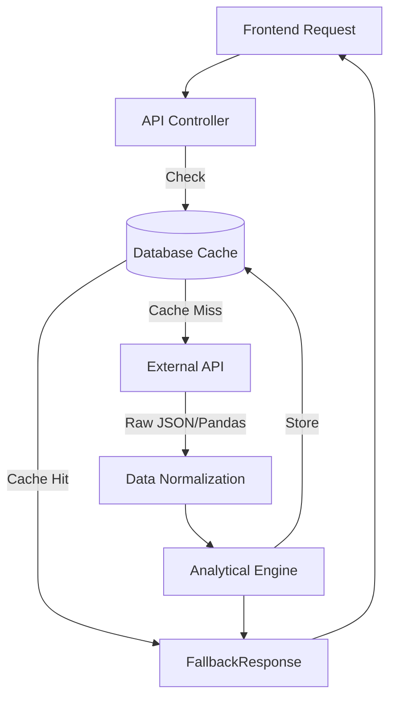

# 03 - DATA PIPELINE

## 1. Market Data Lifecycle
The conceptual flow of market data through STOCKSEE is synchronous but heavily cached to simulate real-time performance while respecting external rate limits.



## 2. Ingestion & Validation
- **Quote / OHLCV**: Fetched via `yfinance` in `market_data_service.py`. The raw pandas DataFrame is checked for empty returns.
- **News**: Fetched via `Finnhub` in `news_service.py`. The raw JSON is sliced to the top 10 articles to limit payload size and NLP processing time.

## 3. Data Normalization
- **Missing Values**: `yfinance` historical data can contain `NaN`. The pipeline interpolates or drops these values.
- **Data Types**: All prices are cast to Python `float`, and volumes to `int` to ensure JSON serialization compatibility.
- **Time Zones**: All timestamps (`published_at`, `generated_at`, `expires_at`) are explicitly forced to UTC (`timezone.utc`) before being stored or returned to the client.

## 4. Storage vs. Caching Strategy
- **Permanent Storage**: User portfolios, watchlists, and user profiles.
- **Temporary Cache**: Quotes (5 min TTL), History (6 hours TTL), Sentiment (3 hours TTL), News (3 hours TTL).
- **On-Demand Calculation**: Technical indicators (RSI, MACD) are calculated on-the-fly from the historical cache, then the final result is cached. They are not stored permanently.
- **Derived Data**: The AI Signal (`generate_signal`) is completely derived from Indicators + Sentiment. It is cached for performance but never stored as a permanent source of truth.

## 5. Data Provenance & Quality
STOCKSEE strictly preserves data provenance via the `_meta` object appended to every service return.
```json
{
  "_meta": {
    "mode": "real",
    "source": "finnhub",
    "generated_at": "2024-03-15T10:00:00Z"
  }
}
```
If an API fails, the mode changes to `"fallback"`, `"stale_cache"`, or `"demo"`. The frontend reads this flag to display honest transparency badges to the user. Data quality precedes analytics—if data is missing, the analytical engine explicitly flags `"available": False` rather than calculating nonsense.
