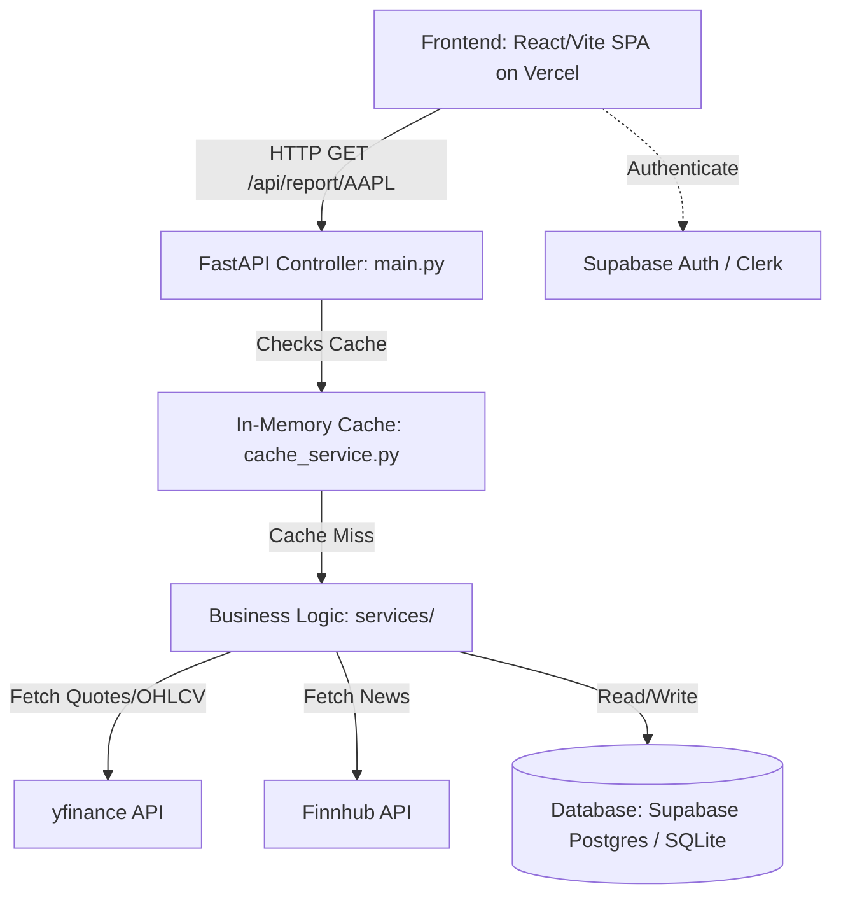

# 04 - PRODUCT ARCHITECTURE

This document represents the actual, validated state of the STOCKSEE architecture, built on Vite, React, FastAPI, SQLite/Supabase, and Render/Vercel.

---

## 1. Current Architecture Map

### Component Map & Data Flow

---

## 2. Component Analysis

### A. Frontend (Client)
- **Responsibility**: Render the UI, manage local state, and coordinate data fetching.
- **Inputs**: User interactions, URL parameters.
- **Outputs**: API requests via `TanStack Query`.
- **Dependencies**: React, Vite, Tailwind, shadcn/ui.
- **Failure Behavior**: If API fails, UI degrades gracefully using standard error boundaries and toast notifications.
- **Production Importance**: Critical. Vercel CDN ensures high availability.

### B. Backend Controller (`main.py`)
- **Responsibility**: Expose HTTP endpoints, validate requests/responses using Pydantic, and format the standardized `FallbackResponse`.
- **Inputs**: HTTP requests.
- **Outputs**: `FallbackResponse` JSON.
- **Dependencies**: FastAPI, Uvicorn.
- **Failure Behavior**: Catches unhandled exceptions, logs them, and returns HTTP 500 (though services attempt to prevent this via fallback data).
- **Production Importance**: Critical. The entry point for all data.

### C. Service Layer (`services/`)
- **Responsibility**: Execute core business logic. Fetch data, compute indicators, run NLP, generate signals.
- **Inputs**: Tickers, raw API payloads.
- **Outputs**: Python dictionaries of processed data.
- **Dependencies**: `pandas`, `vaderSentiment`, external APIs.
- **Failure Behavior**: Surrounds external calls with `try/except`. On failure, invokes internal `_get_demo_data()` and mutates `_meta.mode` to `"demo"`.
- **Production Importance**: Critical. The brain of the application.

### D. In-Memory Cache (`cache_service.py`)
- **Responsibility**: Store expensive payloads (like the mega-report) temporarily to avoid external rate limits.
- **Inputs**: Key-Value pairs with a TTL (Time-To-Live).
- **Outputs**: Cached dictionaries.
- **Dependencies**: Standard Python `dict` or `cachetools`.
- **Failure Behavior**: Defaults to cache miss if data is stale or corrupted.
- **Production Importance**: High. Without this, the yfinance API would block the server within minutes of high load.

### E. Database Layer
- **Responsibility**: Persist user portfolios, watchlists, and eventually historical ML training data.
- **Inputs**: SQLAlchemy ORM objects.
- **Outputs**: SQL queries to SQLite/PostgreSQL.
- **Dependencies**: SQLAlchemy, Alembic.
- **Failure Behavior**: Depends on the connection. If DB goes down, user-specific features (Watchlist/Portfolio) fail.
- **Production Importance**: High. Required for personalization.

---

## 3. Architecture Strengths
1. **Graceful Degradation**: The `FallbackResponse` schema ensures the UI never shows a blank screen, even if Finnhub and Yahoo Finance both go down simultaneously.
2. **Frontend Decoupling**: The Vite SPA is completely isolated from the FastAPI backend, allowing independent scaling and deployment.
3. **Data Aggregation**: The `/api/report` mega-endpoint minimizes frontend waterfall requests, drastically improving perceived performance.

---

## 4. Architecture Weaknesses & Technical Debt
1. **In-Memory Cache Limitations**: `cache_service.py` is local to the Uvicorn worker process. If deployed across multiple workers (e.g., Gunicorn with 4 workers), the cache is not shared, leading to redundant external API calls.
2. **Synchronous Inference**: Running Pandas calculations and NLP sentiment synchronously on the HTTP thread can block other requests under heavy load.
3. **yfinance Reliance**: Scraping Yahoo Finance is inherently unstable compared to a paid, official API.
4. **Auth Duality**: The `.env` files suggest a confusing hybrid of Clerk and Supabase Auth configurations that need consolidation.

---

## 5. Security & Scalability Boundaries
- **Security Boundaries**: JWT validation occurs at the FastAPI middleware/dependency level. Database-level security relies on Supabase RLS policies.
- **Scalability Boundaries**: The primary bottleneck is the Python backend's synchronous data processing and the external API rate limits. 

---

## 6. Future Architecture Roadmap (Target Architecture)
*Note: These are explicitly NOT implemented in Phase 01-04, but documented for future sprints.*

1. **Redis Migration**: Replace the in-memory Python dictionary cache with a centralized Redis instance to allow multi-worker scaling.
2. **Celery / Background Tasks**: Move heavy NLP processing (FinBERT) and indicator calculations to asynchronous background workers.
3. **WebSocket Integration**: Implement `websockets` or Server-Sent Events (SSE) to push live tick data to the frontend instead of relying on TanStack Query polling.
4. **Official Data Providers**: Migrate from `yfinance` to Polygon.io or Alpha Vantage.
5. **Deep Learning Engine**: Replace the heuristic `prediction_service.py` with a deployed TensorFlow/PyTorch model (LSTM) trained on historical OHLCV.
